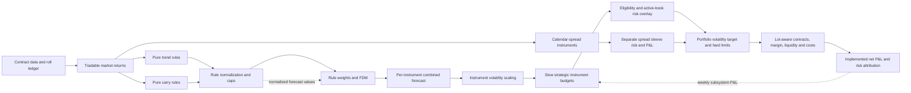

# CTA risk allocation, Carver, and TSMOM: research review and test plan

Research date: 2026-09-16.  Repository state reviewed: commit `4fba179`.

This report answers the research brief in
[`cta-risk-allocation-carver-tsmom-research-prompt.md`](cta-risk-allocation-carver-tsmom-research-prompt.md).
It is a design and pre-registration document, not an ex-post claim that one
allocator or signal has already won. No production code or stored backtest result
was changed.

## Executive decision

The current system is a coherent **risk-budgeted CTA variant**, but it is neither
canonical Moskowitz-Ooi-Pedersen (MOP) TSMOM nor a complete Carver system.

- The Goulding path is a binary direction model: `+1/-1/0` is multiplied by
  inverse volatility and portfolio overlays. This is close in position shape to
  conventional sign TSMOM, although its fast/slow state logic differs from a
  single 12-month sign.
- The continuous path is a bounded strength model. It combines two
  volatility-standardized trailing returns and applies `tanh`; it is not on
  Carver's forecast-10 convention.
- The monthly EWM correlation/ERC path is an **active-book risk allocator**. It
  estimates correlation from raw underlying close-to-close returns, assigns ERC
  budgets among surviving symbols, and applies IDM. It is not Carver's
  instrument-weight bootstrap, which optimizes instrument **subsystem P&L** and
  updates slowly.
- ERC is not categorically superior to Markowitz, and Carver's bootstrap is not
  categorically superior to ERC. ERC discards expected returns and equalizes
  estimated risk contributions. Carver's illustrated bootstrap repeatedly solves
  a constrained Markowitz maximum-Sharpe problem and averages the weights. Each
  answers a different question and inherits different estimation risks.
- For a 12-market, roughly $90,000 futures account, estimation error and whole-lot
  feasibility are at least as important as the continuous optimum. The production
  baseline should therefore be slow, whole-universe, grouped/equal strategic risk
  budgets plus a separate covariance-based risk overlay and the existing
  lot-aware implementation. Shrinkage ERC is the first challenger. A Carver-style
  bootstrap on weekly subsystem returns is a research challenger, not the default.

There is also a material implementation issue that must be frozen or fixed before
the signal comparison: the continuous correction/rebound discount is apparently
applied twice. `continuous_momentum.signal` already equals `ts * discount` in
those regimes, but `resolve_trend_direction` returns the discount again and
`compute_position_scalar` multiplies by it. The effective exposure is therefore
proportional to `ts * discount^2`, before confidence and VIX overlays.

## Direct answers to the motivating questions

### Is `opt_and_plot(..., "expanding", "bootstrap", ...)` ERC?

No. In Carver's public example:

1. `equalisevols=True` rescales every input return column to the same in-sample
   volatility.
2. Each Monte Carlo repetition draws complete rows with replacement.
3. `markosolver` estimates a mean vector and covariance matrix from that sample.
4. SLSQP maximizes Sharpe subject to nonnegative weights that sum to one.
5. The resulting weights are averaged across repetitions.

The code defaults to 200 repetitions of 250 rows and explicitly says this is
**not block bootstrapping**. Because a complete date row is sampled, same-day
cross-asset dependence is preserved inside a draw; serial dependence between
dates is destroyed. See Carver's
[2015 demonstration](https://qoppac.blogspot.com/2015/10/a-little-demonstration-of-portfolio.html)
and the corresponding
[`optimisation.py`](https://github.com/robcarver17/systematictradingexamples/blob/master/optimisation.py).

Volatility equalization does not make this ERC. It expresses weights in equal-risk
units. With `equalisemeans=False`, sampled means remain in the maximum-Sharpe
objective. With `equalisemeans=True` and equal volatility, the long-only
maximum-Sharpe problem collapses to a correlation-based minimum-variance problem.
That still does not impose the ERC condition

\[
w_i(\Sigma w)_i = w_j(\Sigma w)_j \quad \forall i,j.
\]

### What does “slow updates” mean?

It means the estimated **structural weights** should not react to every new day or
month. Carver's examples form expanding out-of-sample fit periods, commonly
re-estimate raw forecast and instrument weights annually, then smooth them. Weekly
returns are input observations; “weekly returns” does not mean “rerun the
optimizer weekly.” Carver explicitly distinguishes a research backtest with
estimated weights from live fixed or handcrafted weights and says he rechecks
those slowly. See
[Correlations, Weights, Multipliers](https://qoppac.blogspot.com/2016/01/correlations-weights-multipliers.html).

Monthly covariance/risk measurement can coexist with annual strategic weights:

- annual or very slow: instrument budgets and rule weights;
- monthly: EWM covariance, IDM/risk cap, volatility target, eligibility;
- daily: mark-to-market, rolls, hard limits, and exceptional risk gates.

### Do whole-universe weights simply get renormalized over active symbols?

Not necessarily. That is one policy, but it changes the economic hypothesis.

- **No renormalization:** a zero forecast leaves its strategic budget in cash.
- **Common portfolio-volatility overlay:** keep the relative exposures of the
  nonzero forecasts, then apply one multiplier to the aggregate book.
- **Renormalization among survivors:** deliberately redeploy inactive budgets.
- **Active-set ERC:** re-solve all relative risk budgets among survivors; this is
  more than renormalization because correlations change the relative weights.

The current IDM/ERC path uses the last policy after signal thresholding and
optional cluster selection. That is internally coherent, but it is not the same
as Carver's slow whole-universe instrument weights times forecasts.

### What returns should be used, and over what period?

There is no single correct `H`, because there are several distinct decisions:

| Decision | Appropriate history | Preferred observations | Return object |
|---|---|---|---|
| Strategic instrument weights | Expanding history; update annually | Weekly synchronized returns | Net subsystem P&L after frozen forecast blend and instrument-vol scaling |
| Forecast-rule weights | Expanding/poolable history; update annually | Weekly rule P&L | Net P&L for each normalized rule on a common instrument/risk basis |
| Forecast diversification multiplier | Expanding or long EWM; update/smooth slowly | Weekly forecast values | Correlation of normalized forecast values, not market returns |
| Monthly risk budget/IDM | Bounded recent history, e.g. current 3 years with 63- or 126-day half-life | Synchronized daily or weekly returns | Raw or dynamically volatility-normalized underlying returns |
| Realized active-book risk | Same covariance snapshot used for sizing | Current positions | Signed post-rounding dollar-vol exposures through the covariance/correlation matrix |
| Small-account execution | Current book plus scenarios | Contract-level | Final pre-cost/net sleeve P&L and actual margin/lot jumps |

Static positive fractional scaling does not change correlation. Dynamic volatility
scaling, sign changes, forecast magnitude, missingness, activity gates, and lot
rounding do. Consequently, a strategy-return `H` can differ materially from an
underlying-return `H` even when every market uses the same trading rule.

## 1. Current implementation map

### 1.1 Signals

#### Continuous path

[`continuous_momentum`](../src/derivatives_bt_engine/domain/signal.py#L472):

- computes simple fast/slow trailing returns;
- divides each by its horizon-matched daily standard deviation times
  `sqrt(window)`;
- combines available legs with 0.4/0.6 weights;
- applies `tanh`, producing `ts` in `[-1, 1]`;
- classifies bull/bear/correction/rebound from the two leg signs; and
- writes `signal = ts * discount` in correction/rebound.

Thus `ts` is the pre-regime-discount bounded trend score and `signal` (reported as
`contin_signal` in live code) is already post-discount. It is volatility
standardized as a feature and separately inverse-volatility-scaled in position
sizing. It is not calibrated so that historical mean absolute forecast equals 10.

#### Goulding path

[`goulding_monthly`](../src/derivatives_bt_engine/domain/signal.py#L618) forms
lagged means of completed monthly simple returns, by default two and twelve
months. There is no volatility standardization in this function.
[`_goulding_blend`](../src/derivatives_bt_engine/domain/signal.py#L666) computes
the fast/slow blend in correction/rebound, and
[`_goulding_direction`](../src/derivatives_bt_engine/domain/signal.py#L725) takes
its sign. Bull is `+1`, bear is `-1`, and an exactly zero blend is flat.

Goulding, Harvey, and Mazzoleni study dynamic blending of fast and slow momentum
around turning points. The repository makes an additional design choice: it
throws away the blend magnitude and retains direction. The code is therefore a
**binary Goulding-direction adaptation**, not a literal continuous portfolio
weight from the paper. The raw blend is already retained for audit and is a
natural pre-registered continuous challenger.

#### Confirmed double discount

[`resolve_trend_direction`](../src/derivatives_bt_engine/domain/signal.py#L849)
receives `continuous_momentum.signal`, then returns `regime_discount_cfg` again
for correction/rebound. Both live and backtest call
[`compute_position_scalar`](../src/derivatives_bt_engine/domain/allocation.py#L49),
which multiplies the returned trend strength by that discount. Subject to no
other cap, continuous correction/rebound exposure is currently

\[
\text{position scalar}
= ts\;d^2\;\frac{\sigma^*}{\hat\sigma}\;c\;v,
\]

where `d` is the regime discount, `c` confidence, and `v` the VIX overlay.
Comments in both functions describe only one discount, so this appears
unintentional. The Goulding path correctly returns a regime discount of 1.

### 1.2 Allocation and `H`

[`build_returns_wide`](../src/derivatives_bt_engine/domain/allocation.py#L1087)
computes daily close-to-close simple returns and inner-joins every supplied
symbol. This has two implications:

1. the estimator uses raw underlying returns, not strategy returns; and
2. dates missing for any symbol in the supplied dictionary are discarded before
   the active subset is passed to `H`.

[`_bounded_ewm_correlation_matrix`](../src/derivatives_bt_engine/domain/allocation.py#L1107)
uses only rows strictly before the rebalance date, first bounds the history, and
then applies recency weights. The joint weighted Gram construction produces a PSD
correlation matrix. Current defaults are a three-year outer window and 63-trading-
day half-life. An explicit coverage vector distinguishes “unmeasured” from a true
zero correlation.

[`compute_erc_weights`](../src/derivatives_bt_engine/domain/allocation.py#L1313)
solves equal risk contribution on this correlation matrix. Using correlation
rather than raw covariance is deliberate because per-instrument inverse-volatility
sizing already equalizes standalone risk.

[`compute_symbol_notional_budget`](../src/derivatives_bt_engine/domain/allocation.py#L1598):

1. obtains flat, ERC, or HRP risk-budget shares `w`;
2. computes `IDM = 1/sqrt(w' H w)` when enabled;
3. defines aggregate component dollar-vol as
   `capital * target_portfolio_vol * IDM`;
4. assigns each market that total times `w_i`; and
5. divides by the per-instrument volatility target because the later position
   scalar applies `vol_target / realized_vol`.

For a fractional pre-signal book, this algebra is coherent: component risks
`capital * target_vol * IDM * w_i` yield portfolio risk `capital * target_vol`.
Forecast attenuation, overlays, caps, changing signs, and integer lots mean the
implemented book need not hit that target.

[`compute_idm`](../src/derivatives_bt_engine/domain/allocation.py#L1730) floors
negative correlations at zero only for the multiplier. ERC and HRP use the signed
matrix. [`compute_realized_portfolio_risk`](../src/derivatives_bt_engine/domain/allocation.py#L1782)
correctly passes signed post-sizing dollar-vol exposure through `H` and produces
Euler risk contributions.

### 1.3 Live path

In [`tsmom_rebalance.py`](../src/derivatives_bt_engine/live/tsmom_rebalance.py):

- live computes both signal families, selects the configured one, and retains the
  other for diagnostics;
- `_is_active` requires a valid signal whose absolute value exceeds
  `min_conviction` (default 0.05);
- optional cluster-universe selection happens before `H`, ERC, and IDM;
- in IDM mode, `H` is estimated on the selected active set;
- `combined_scalar` includes direction/strength, inverse volatility, the repeated
  regime discount noted above, optional confidence, and VIX scaling; and
- whole-contract implementation uses the lot-aware allocation path by default.

`combined_scalar` is therefore a position scalar, not a forecast. It must never be
normalized to mean absolute 10.

### 1.4 Backtest path and divergences

[`tsmom_backtester.py`](../src/derivatives_bt_engine/domain/tsmom_backtester.py)
shares the signal-resolution and allocation functions, but parity is incomplete:

| Concern | Live | Backtest | Consequence |
|---|---|---|---|
| Active threshold | `abs(signal) > min_conviction` | `scalar != 0` in correlation-aware pass | A continuous `tanh` signal is almost always active in backtest but can be excluded live |
| Lot-aware allocator | Present; evaluates discrete candidates | Independent `round()` plus optional cap | Backtest does not reproduce the live integer book |
| Portfolio-vol path | Normal rebalance flow | Only standard monthly path | Pre-start seed and daily off-cycle signal-gate paths bypass it |
| Signal confidence | Optional live multiplier | Not passed in ordinary backtest signal row | Position scalars may diverge when enabled |
| VIX exceptional states | Live account target logic | Backtest holds/halves by its own event loop | Requires event-by-event parity tests |
| Strategic weight layer | None separate from monthly active allocation | None | Neither path currently represents Carver's slow instrument weights |

The backtester itself documents an earlier run in which correlation-aware sizing
reduced a 25.37% realized volatility to 7.16% against a 15% target. That is useful
diagnostic evidence of directionally safer sizing, not proof of calibration or
allocator superiority.

### 1.5 Data and roll preconditions

A read-only query of `/home/dev/fin/db/globex_mdp_3.0.duckdb` on 2026-09-16 found
the default twelve mapped markets (`ES`, `NQ`, `CL`, `ZL`, `ZC`, `ZS`, `ZW`,
`GC`, `SI`, `6J`, `6M`, `ZN`) spanning 2010-06-07 through 2026-06-18. Financial
contracts have about 4,153–4,160 distinct dates; grains have about 4,040–4,041.

The repository's continuous price loader changes the selected contract but does
not visibly back-adjust the close series at the allocation/signal layer. Before
interpreting strategy returns, audit returns on every detected roll date. A raw
price jump caused by switching contract levels is not economic mark-to-market
return, and it can contaminate momentum, realized volatility, `H`, and an apparent
carry effect. This is a precondition check, not a claim that every current roll is
wrong.

The existing
[`term_structure_diagnostic.py`](../scripts/term_structure_diagnostic.py) ranks
front and next contracts and reports their price spread. It does not yet produce a
tradable carry forecast, two-leg calendar-spread P&L, margin, or execution ledger.

## 2. The architecture that keeps the concepts separate

The important feedback loops use different objects:

- normalized **forecast values** estimate forecast correlations/FDM;
- rule **P&L** estimates forecast-rule weights;
- instrument **subsystem P&L** estimates strategic instrument weights;
- underlying or vol-normalized market returns estimate fast active-book risk;
- final contracts and costs determine the implemented P&L used for validation.

## 3. Signals: binary TSMOM, continuous strength, and Goulding

### 3.1 What the literature supports

Moskowitz, Ooi, and Pedersen find positive time-series predictability over roughly
one to twelve months in 58 liquid futures/forwards, with partial longer-horizon
reversal, and construct sign-based, inverse-volatility-scaled positions
([MOP 2012](https://fairmodel.econ.yale.edu/ec439/mosk.pdf)). Hurst, Ooi, and
Pedersen extend trend-following evidence far backward, reporting positive average
performance in each decade of their long sample and favorable performance in many
large 60/40 drawdowns
([Century of Evidence](https://papers.ssrn.com/sol3/papers.cfm?abstract_id=2993026)).
Hurst, Ooi, and Pedersen also show that simple 1-, 3-, and 12-month trend rules can
explain much of managed-futures behavior
([Demystifying Managed Futures](https://pages.stern.nyu.edu/~lpederse/papers/DemystifyingManagedFutures.pdf)).

This evidence supports a binary sign baseline, multi-horizon trend, and
instrument-level volatility scaling. It does **not** establish that `+1/-1` is
universally optimal. The same Demystifying paper explicitly notes that strength-
dependent positions are possible. Baltas and Kosowski show that signal and
volatility-estimator design affect turnover, leverage, and correlations, and
report turnover reductions without a significant performance sacrifice in their
specification
([Baltas-Kosowski](https://papers.ssrn.com/sol3/papers.cfm?abstract_id=2140091)).
Huang et al. challenge some standard TSMOM inference and show sensitivity to the
benchmark for expected returns
([Huang et al.](https://www.sciencedirect.com/science/article/pii/S0304405X19301953)).

The correct conclusion is not “binary beats continuous” or the reverse. Binary
and continuous versions must be risk matched, costed, and tested on the same
implemented books.

### 3.2 Interpretation of the repository candidates

| Candidate | Meaning | Scale | Treatment in research |
|---|---|---|---|
| Goulding direction | State-dependent sign of monthly fast/slow momentum | `-1, 0, +1` | Primary binary baseline |
| Current continuous `ts` | `tanh` of weighted horizon-Sharpe-like scores | `[-1, 1]` | Primary strength candidate after resolving double discount |
| Raw Goulding blend | Continuous fast/slow blend in disagreement states; bull/bear magnitude still needs a definition | Unbounded return units | Separate challenger, not silently substituted |
| Canonical 12-month sign | Sign of lagged 12-month excess return | `-1, 0, +1` | Literature anchor/control |
| Carver-style EWMAC family | Several capped, normalized crossover forecasts | Conventionally around `[-20, 20]`, mean absolute 10 | Later rule-family challenger; control multiplicity |

Goulding, Harvey, and Mazzoleni's turning-point work motivates changing the mix of
fast and slow momentum around regimes
([published paper](https://people.duke.edu/~charvey/Research/Published_Papers/P158_Momentum_turning_points.pdf)).
The repository's sign conversion should be tested as its own implementation. A
continuous “Goulding strength” variant must be fully specified in advance,
including bull/bear magnitudes, normalization, cap, and lagging.

### 3.3 Forecast-10 normalization

Carver's average-absolute-forecast convention is a unit convention that makes
heterogeneous rules comparable before combination. For a raw rule forecast
`f_raw`, a causal scalar can be defined from prior pooled or expanding data:

\[
F_{i,r,t} = \operatorname{clip}\left(
10\frac{f^{raw}_{i,r,t}}{E_{s<t}|f^{raw}_{i,r,s}|},-20,20\right).
\]

Then the forecast fraction in position sizing is `F/10`. The estimator, pooling
set, minimum observations, update dates, cap, and fallback must all be frozen.

Implications for this repository:

- Mapping binary `+1/-1` to `+10/-10` and later dividing by 10 changes nothing.
- Scaling the continuous score so mean absolute forecast becomes 10 **can** change
  its average exposure because `E|ts|` is below one. The portfolio must be
  re-risk-matched; this is not a free performance improvement.
- Applying a time-varying forecast scalar after `tanh` can undo the intended
  calibration. A cleaner challenger calibrates the `tanh` slope on prior data or
  normalizes the pre-squash rule, then caps once.
- Normalize each pure rule before weighting trend and carry. Apply a forecast
  diversification multiplier to their weighted combination if desired.
- Never normalize `combined_scalar`: it contains forecast, inverse volatility,
  confidence, regime, VIX, caps, and potentially other portfolio effects.

## 4. Carver's three separate optimization problems

Carver's framework is easily misread because the same optimizer can appear at
several layers.

### 4.1 Forecast-rule weights

For one instrument, each rule creates a normalized forecast and a corresponding
costed rule P&L. Forecast weights can be estimated from those rule P&Ls, often
pooling comparable instruments because each individual instrument has too little
history. Correlated trend speeds are redundant; carry may receive substantial
weight because it is less correlated. Forecast correlations for FDM are instead
correlations of forecast values. Carver estimates slowly and smooths the results.

### 4.2 Instrument weights

Once each instrument has a combined forecast and volatility-scaled subsystem
position, the optimizer sees one P&L stream per **instrument subsystem**. The
2016 post constructs instrument weights from `pandl_for_subsystem`, not raw
underlying returns. Missing-history cleaning, annual updates, and smoothing are
part of the procedure.

### 4.3 Diversification multipliers

FDM restores the conventional scale of a weighted forecast blend; IDM restores
portfolio risk after instruments are combined. They do not determine the same
relative weights as forecast/instrument optimization. They should not be used to
count the same diversification twice.

### 4.4 Why the 2015 demo is not a turnkey replacement here

The three-asset 2015 post demonstrates estimation methods. It assumes a mostly
dense portfolio and warns that bootstrapping is problematic for sparse selection.
The public code has rough missing-data handling, IID row resampling, and random
Monte Carlo variation. Carver later emphasizes robust handcrafting; his 2019
empirical comparison includes naive Markowitz, bootstrap, shrinkage, equal
weights, and handcrafted weights, and judges robustness and sparsity as well as
profitability
([handcrafting tests](https://qoppac.blogspot.com/2019/02/portfolio-construction-through_9.html)).

For this project, a faithful Carver challenger would therefore use:

- weekly, synchronized **subsystem returns**, preferably net of realistic costs;
- whole eligible-universe strategic weights rather than each month's signal-
  active set;
- expanding estimation with annual updates and smoothing/buffering;
- long-only risk-budget weights with bounds/floors appropriate to 12 markets;
- explicit missing-history cleaning;
- fixed random seeds and stored diagnostics; and
- either Carver's IID row bootstrap or a separately labeled stationary/block
  bootstrap sensitivity.

## 5. Risk allocation methods: what each actually solves

### 5.1 Equal or inverse-volatility weighting

After every instrument has the same standalone volatility target, equal weight is
equal dollar-volatility. It is transparent, has no mean or correlation estimation
error, and is a high hurdle. DeMiguel, Garlappi, and Uppal found that none of 14
optimized models consistently beat `1/N` out of sample across their studied
datasets
([DeMiguel et al.](https://ideas.repec.org/a/oup/rfinst/v22y2009i5p1915-1953.html)).
That equity-allocation result is not a proof for CTA subsystems, but it is a strong
warning against giving parameter-rich estimators a low hurdle.

### 5.2 Minimum variance and maximum diversification

Markowitz optimization combines expected returns and covariance; minimum variance
drops the mean vector
([Markowitz 1952](https://doi.org/10.1111/j.1540-6261.1952.tb01525.x)).
When returns are vol-equalized and means are equal, maximum Sharpe and minimum
variance depend only on correlation. Minimum variance can concentrate in the
lowest-correlation combination and is unstable when covariance is noisy.

Maximum diversification maximizes the weighted average standalone volatility
relative to portfolio volatility; with equalized standalone vols it is closely
related to minimum variance, but not generally identical to ERC
([Choueifaty-Coignard](https://www.tobam.fr/wp-content/uploads/2014/12/TOBAM-JoPM-Maximum-Div-2008.pdf)).

### 5.3 ERC/risk parity

ERC solves for equal ex-ante contributions to portfolio volatility. Maillard,
Roncalli, and Teiletche show that its volatility lies between equal weight and
minimum variance in their setup and present it as a diversification/risk-budget
trade-off
([Maillard et al.](https://www.thierry-roncalli.com/download/erc.pdf)). Qian's
risk-parity formulation likewise focuses on distributing risk rather than capital
([Qian 2005](https://www.panagora.com/wp-content/uploads/2011/09/PanAgora-Risk-Parity-Portfolios-Efficient-Portfolios-Through-True-Diversification.pdf)).

Advantages here:

- no expected-return estimates;
- direct interpretation as risk budgets;
- sensible after instrument vol equalization; and
- compatible with signed positions because the budget weights can remain
  nonnegative while realized exposure carries the forecast sign.

Limitations:

- correlations are still estimated;
- active-set ERC redeploys risk whenever a symbol crosses the threshold;
- crowded clusters can still receive substantial total budget depending on `H`;
- equal estimated contribution is not equal realized contribution; and
- whole-contract rounding can dominate the intended weights.

### 5.4 Shrinkage, HRP, and handcrafted groups

Ledoit and Wolf show why sample covariance estimation error is especially harmful
inside an optimizer and propose shrinkage toward a structured target
([Ledoit-Wolf](https://ledoit.net/honey.pdf)). Shrinking the correlation matrix
toward identity or constant correlation before ERC/minimum variance is therefore
a more defensible challenger than adding more rapid re-estimation.

Hierarchical risk parity clusters related assets and recursively allocates risk,
avoiding matrix inversion
([López de Prado](https://papers.ssrn.com/sol3/papers.cfm?abstract_id=2708678)).
It can be useful diagnostically, but dendrogram instability and the small number
of markets prevent it from being presumed superior.

Handcrafted/grouped budgets encode the strongest available prior: equities,
rates, FX, energy, grains, and metals should receive deliberate top-level budgets,
with simple within-group weights. They trade a small amount of theoretical
efficiency for stability, auditability, and a far smaller multiple-testing burden.

### 5.5 Verdict: ERC versus bootstrapped Markowitz

Neither dominates theoretically:

| Feature | EWM-H/ERC | Carver bootstrap maximum Sharpe |
|---|---|---|
| Expected means | Ignored | Used unless equalized/shrunk |
| Risk objective | Equal marginal contributions | Maximum estimated Sharpe |
| Estimation burden | Correlation/covariance | Means plus covariance in every sample |
| Stability device | EWM/bounded window; optional shrinkage | Average many optimized samples |
| Natural role here | Monthly risk budgeting/overlay | Slow strategic subsystem weights |
| Main failure | Unstable active set/correlation; false precision | Mean error, corner solutions, bootstrap randomness |
| Small-account issue | Tiny ERC weights round to zero | Averaged tiny weights also round to zero |

With only about 13 genuinely scored years after a three-year initialization, the
data cannot estimate 12 separate subsystem means with high precision. Equal means
or strong shrinkage is the credible bootstrap specification. The unrestricted
sample-mean bootstrap belongs in sensitivity analysis, not the production
baseline.

## 6. Which `H` belongs at which layer?

Let `r_i,t` be a tradable underlying return, `sigma_i,t` a lagged volatility
estimate, `x_i,t-1` a frozen forecast-times-instrument-vol exposure, and `e_i,t-1`
the final exposure after portfolio rules.

| Estimator | Series | What it measures | Best use | Main caveat |
|---|---|---|---|---|
| Raw underlying | `r_i,t` | Co-movement of markets | Fast market-risk overlay; stress reporting | Static volatility differences do not affect correlation, but rolls/time zones do |
| Vol-normalized underlying | `r_i,t / sigma_i,t-1` | Co-movement under dynamic inverse-vol exposure | Risk budgeting consistent with instrument scaling | Dynamic denominator changes correlation and can add estimator noise |
| Dynamic strategy | `x_i,t-1 r_i,t` | Diversification of the intended frozen subsystem | Slow strategic instrument weights | Signal family and parameters become part of `H` |
| Final sleeve | `e_i,t-1 r_i,t` | Realized diversification after all policies | Top-level sleeve allocation and implementation attribution | Endogenous activity/rounding can make history sparse |

Recommendations:

1. Rename conceptually, even if not yet in code:
   - `H_market`: recent underlying/vol-normalized returns for monthly live risk;
   - `H_subsystem`: weekly subsystem P&L for annual strategic weights;
   - `H_forecast`: normalized forecast-value correlations for FDM.
2. Preserve complete same-date cross-sections in resampling. If a date row is
   selected, select all markets together.
3. Use weekly non-overlapping observations for slow cross-time-zone structural
   estimation; Carver notes that daily closes can understate correlations across
   time zones.
4. Do not sign-flip `H_market` and then also apply signed exposures in
   `x'Hx`; that double-applies direction.
5. Audit pairwise availability. The current all-symbol inner join discards a date
   even if only an irrelevant inactive market is missing.

## 7. Universe and inactivity policies

“Inactive” must be split into four states:

1. missing history/not estimable;
2. untradable or liquidity/margin ineligible;
3. valid forecast exactly or economically near zero; and
4. valid forecast excluded by a portfolio concentration rule.

They must not all become the same zero before weight estimation.

| Policy | Zero forecast | `H` and weights | Risk redeployment | Behavior |
|---|---|---|---|---|
| Whole-universe strategic weights × signal | Keeps strategic weight but exposure is zero | Slow subsystem `H`, all eligible markets | None automatically | Preserves economic priors; holds cash in weak trends |
| Active-set ERC | Removes symbol, re-solves ERC/IDM | Recent market `H`, above-threshold set | Full relative redeployment | Maintains risk but creates threshold discontinuity/concentration |
| Whole universe + cash sleeve | Zero exposure explicitly becomes cash | Slow strategic weights | None | Clearest interpretation for sparse continuous/carry forecasts |
| Whole universe + portfolio-vol target | Zero first, then common multiplier on survivors | Slow weights plus active risk estimate | Common scale only | Preserves relative survivor weights; can lever a concentrated book |
| Slow weights + fast risk overlay | Strategic weights fixed; limits react | Both `H_subsystem` and `H_market` | Only within explicit overlay bounds | Recommended separation |

For binary Goulding, nearly every estimable market is ordinarily long or short,
so active-set ERC often approximates whole-universe ERC. For the continuous
model, the 0.05 gate makes activity endogenous to forecast calibration. Changing
the `tanh` slope or forecast-10 scalar can then change both exposure magnitude and
which symbols receive budgets. This is a hidden second use of the signal and must
be isolated in tests.

Recommended baseline policy: keep slow whole-universe strategic budgets; a valid
zero signal leaves risk unused; a common portfolio-vol multiplier may scale the
actual active book, subject to leverage, concentration, and minimum-breadth caps.
Retain active-set ERC as a challenger because deliberate risk redeployment may be
valuable for a small account, but label it accordingly.

## 8. Volatility targeting

Instrument volatility scaling is central to canonical TSMOM: it prevents the
highest-volatility contracts from dominating. Portfolio-volatility targeting is a
separate decision. Moreira and Muir find that inverse-volatility timing improves
risk-adjusted results for several factors because expected returns do not rise
proportionally with volatility
([Moreira-Muir](https://www.nber.org/papers/w22208)). Harvey et al. find the effect
varies across assets, with particularly useful downside behavior in some risky
assets
([Harvey et al.](https://people.duke.edu/~charvey/Research/Published_Papers/P135_The_impact_of.pdf)).
Cederburg et al., however, find that across 103 equity strategies,
volatility-managed versions do not systematically beat unmanaged versions in
direct implementable out-of-sample comparisons
([Cederburg et al.](https://www.lehigh.edu/~xuy219/research/COWY.pdf)).

Therefore:

- retain instrument inverse-volatility scaling as a common control;
- test the portfolio target rather than presuming alpha;
- cap the multiplier and require minimum breadth so a sparse book is not levered
  back to the same target automatically;
- report target versus ex-ante fractional risk versus post-lot realized risk;
- charge turnover and spread costs caused by volatility changes; and
- distinguish attenuation by a weak forecast from accidental under-risk caused
  by unaffordable lots.

## 9. Carry and calendar spreads

Carry predicts returns across and within asset classes, but it has distinct crash
and macroeconomic exposures
([Koijen, Moskowitz, Pedersen, and Vrugt](https://www.nber.org/papers/w19325)).
Commodity basis and inventories are linked to futures risk premia
([Gorton, Hayashi, and Rouwenhorst](https://www.nber.org/papers/w13249)). Carry is
therefore a plausible diversifier to trend, but the implementation object matters.

### Outright carry forecast

For each underlying, define a lagged annualized curve/basis measure with contract-
specific time-to-expiry and financing conventions. Normalize it as a pure forecast,
cap it, estimate trend/carry rule weights from costed rule P&Ls, and apply an FDM
from forecast-value correlations. This produces one combined outright forecast.

### Separate carry sleeve

Keep trend and carry as distinct instrument subsystems and allocate between their
net sleeve P&Ls at the strategy layer. This is easier to attribute and protects
against one rule's cost or drawdown being hidden inside a combined forecast.

### Calendar-spread instrument

A front/back calendar spread is a two-leg tradable with its own:

- contract pair and roll calendar;
- dollar value per curve move and spread volatility;
- two-leg bid/ask and slippage;
- margin offsets that can change;
- liquidity and legging risk; and
- P&L series.

It should enter as a separate instrument or sleeve, not as a scalar pasted onto an
outright future. Allocate top-level risk only after constructing that P&L. Audit
double counting: an unadjusted continuous outright series can mechanically include
contract-switch level changes, while a carry/spread rule also trades the curve.

Recommended sequencing is trend first, outright carry second, then calendar
spreads only after a two-leg ledger and risk model exist. Do not add all three in
one performance search.

## 10. Small-account and integer-contract reality

The repository already contains a decisive example. In the 2026-09-10 $90,000
Goulding/IDM/ERC dry run, all twelve signals were active, but six targets rounded
to zero. Post-rounding portfolio risk was about $9,402, or 10.4% of equity,
against a 15% target. One MNQ contract alone represented about 12.7% of equity in
standalone annualized dollar-vol. See
[`live-rebalance-90k-goulding-idm-rounding.md`](live-rebalance-90k-goulding-idm-rounding.md).

This changes the optimizer comparison. A mathematically smooth 2% ERC allocation
that always rounds to zero is not diversification. A slightly less efficient
continuous allocation that yields a feasible micro contract may be better.

Every candidate must therefore report two books:

1. ideal fractional targets; and
2. actual integer contracts after price, multiplier, tick, margin, liquidity,
   cluster, and concentration constraints.

The implementation objective should minimize a transparent combination such as

\[
\min_{q\in\mathbb{Z}^n}
\lambda_1\left|\hat\sigma_p(q)-\sigma^*\right|
+\lambda_2\sum_i\left|RC_i(q)-b_i\sigma^*\right|
+\lambda_3\operatorname{turnover}(q,q_{old}),
\]

subject to margin/cash, position, cluster, liquidity, and hard portfolio-risk
limits. Lexicographic priorities are safer in production: never breach risk or
margin; then minimize risk-target error; then budget error; then turnover. An
optimizer must be allowed to hold cash and declare the target infeasible.

Micro futures help but do not eliminate discontinuity. Report one-contract dollar
vol, the marginal change from `q` to `q±1`, risk-budget deviation, unused risk,
number of nonzero positions, and Herfindahl/effective-number concentration.

## 11. Pre-registered candidate matrix

The table deliberately limits the family. A giant signal × allocator × universe
grid would consume the 16-year sample through data snooping.

| ID | Signal | Strategic allocation | Fast `H` / universe | Update | Forecast normalization | Carry/spread | Principal failure mode |
|---|---|---|---|---|---|---|---|
| B0 | Goulding binary direction | Equal top-level cluster risk; equal within cluster | Shrunk `H_market` for monitoring/portfolio scale; whole eligible universe | Annual budgets, monthly risk | `±10` convention only; no economic change | None | Ignores strength; discrete cluster imbalance |
| B1 | Corrected continuous `tanh` | Same as B0 | Same as B0; zero signal leaves cash | Annual/monthly | Causal pooled forecast-10 calibration, cap once | None | Calibration/tanh redundancy; attenuation underuses risk |
| C1 | B0 and B1 reported separately | Whole-universe shrinkage ERC | Three-year EWM, 63-day half-life; 126-day sensitivity | Monthly ERC, buffered | As above | None | Correlation noise and weight turnover |
| C2 | B0 and B1 reported separately | Whole-universe Carver bootstrap on net weekly subsystem P&L, equal means | `H_market` only for risk overlay | Annual, smoothed | As above | None | Short history; bootstrap randomness; small weights |
| S1 | Same as C2 | Carver bootstrap with sample means | Same | Annual | Same | None | Mean-estimation error; corner/cumulative selection bias |
| U1 | Best robust signal/weight pair from prior stage | Recalculate ERC on above-threshold active set | Current three-year EWM `H` | Monthly | Same fixed calibration | None | Endogenous threshold and forced redeployment |
| A1 | Frozen trend winner + normalized outright carry | Fixed grouped or shrinkage ERC | Whole-universe, style-aware subsystem risk | Annual/monthly | Normalize rules separately; FDM | Outright carry only | Trend/carry correlation and cost mismeasurement |
| A2 | Frozen trend/carry plus spread sleeve | Top-level robust sleeve budgets | Net sleeve `H` | Annual/monthly | Rule-specific | Separate two-leg spreads | Double counting, margin/legging risk, inadequate history |

HRP and raw EWM covariance minimum variance should be reported as secondary
allocation diagnostics, not promoted into the primary family unless they beat the
robust baselines without concentration or turnover deterioration.

## 12. Sixteen-year walk-forward protocol

### 12.1 Data accounting

The available daily history is approximately 2010-06-07 to 2026-06-18, not 16
years of clean out-of-sample observations for every estimator. A 252-day signal
warm-up leaves about 15 years. A three-year `H` initialization leaves about 13
years. Without pre-2010 training data, any claim of “16-year out of sample” for a
three-year estimator is false unless the early years use a declared fallback.

Primary scoring period:

- **Initialization:** 2010-06-07 through 2013-06-30.
- **Scored anchored walk-forward:** 2013-07-01 through 2026-06-18.
- **Rebalances:** the repository's common month-end decision/execution calendar,
  with every input strictly lagged.
- **Outer reporting folds:** July through the following June, producing 12 full
  years plus the final partial year.

If reliable pre-2010 data are later added, retain these calendar boundaries and
use the earlier data only for warm-up/estimation. Do not redesign candidates after
viewing improved results.

### 12.2 Phase zero: non-performance audit

Before scoring:

1. classify the continuous double-discount behavior as either a fixed bug or an
   explicitly named legacy candidate;
2. reconcile live/backtest active thresholds, confidence, VIX events, and lot
   allocation;
3. audit contract roll returns and P&L on every switch date;
4. validate no future contract, close, volatility, or monthly return enters a
   decision;
5. freeze costs, commissions, slippage, margin, multipliers, and liquidity rules;
6. freeze capital at the intended small-account size and define cash interest;
7. snapshot exact data hashes and configuration.

Use synthetic/unit tests and date-level audit rows for this phase, not Sharpe
improvement as the acceptance criterion.

### 12.3 Stage 1: signal comparison under one allocator

Use B0's fixed grouped strategic budgets for all signals. Compare:

- canonical lagged 12-month sign;
- repository Goulding binary direction;
- corrected current continuous `tanh`; and
- at most one pre-specified continuous Goulding-blend variant.

Fix the same instrument vol estimator, portfolio target, costs, universe,
eligibility, and integer allocator. This identifies signal behavior without
confounding it with ERC or bootstrap weights. Report continuous and integer books.

Do not select a single winner mechanically. Retain two signals only if their
paired net-return evidence, drawdown shape, turnover, and implemented feasibility
show meaningful differences. If inconclusive, prefer the simpler binary baseline
or an equal-weight ensemble fixed before Stage 2.

### 12.4 Stage 2: allocation comparison

Apply the frozen signal set to:

1. grouped/equal strategic risk budgets;
2. current EWM-H/ERC as a legacy active-set challenger;
3. whole-universe shrinkage ERC;
4. EWM covariance minimum variance with weight bounds;
5. Carver expanding bootstrap with equal means; and
6. Carver expanding bootstrap with heavily shrunk/sample means as a research-only
   sensitivity.

Pre-register these estimator details:

| Estimator | History | Observations | Parameters | Constraints |
|---|---|---|---|---|
| Current ERC | trailing 3 years | daily synchronized returns | half-life 63 days | nonnegative, sum 1 |
| Slower ERC | trailing 5 years where available | daily | half-life 126 days | same |
| Shrinkage ERC | trailing 3 years | daily/weekly sensitivity | analytic or frozen prior-data shrinkage toward constant correlation | same |
| Min variance | trailing 3 years | dynamically vol-normalized returns | same shrinkage | 2.5%–20% weight bounds, sum 1 |
| Carver IID | expanding | weekly subsystem returns | 500 resamples; 104 rows per resample; fixed seed; equal vols and equal means | long-only, 2.5%–20%, sum 1 |
| Stationary bootstrap | expanding | weekly subsystem returns | 500 resamples; expected block length 4 weeks; fixed seed | same |

Carver's public defaults are 200 × 250 daily rows in the illustrative code and
104 weekly rows in the later system example. The proposed 500 × 104 weekly design
reduces Monte Carlo noise while staying close to his instrument-weight practice.
IID and stationary bootstraps must be labeled separately. The stationary
bootstrap preserves short serial episodes; neither creates new market regimes.

Weights are estimated at each July boundary using only earlier data, held or
smoothly transitioned for the next twelve months, and never selected using that
same future fold. Monthly `H_market` may still scale or cap risk without changing
the strategic relative budgets beyond predeclared bounds.

### 12.5 Stage 3: universe policy

Only for the robust baseline and at most two allocation challengers, compare:

- whole-universe weights with cash for valid zero forecasts;
- whole-universe weights plus a common portfolio-vol multiplier; and
- active-set ERC/redeployment.

Predeclare minimum breadth, maximum cluster share, multiplier cap, and whether an
untradable market's budget may be redeployed. This isolates the question the
current framework confounds: “how strong is the signal?” versus “who receives the
unused risk?”

### 12.6 Stage 4: carry and calendar spreads

Only after Stages 1–3 are frozen:

1. add a normalized outright carry rule and test its paired incremental net P&L;
2. compare forecast combination versus a separate carry sleeve; and
3. add calendar spreads only when a two-leg historical execution/margin model is
   validated.

No trend or allocator hyperparameter may be retuned after adding carry.

### 12.7 Nested selection without pretending the data are larger

At every outer July boundary, an optional model-selection rule may use only
earlier annual folds. It must be simple, for example:

- require at least three prior scored years;
- choose only among the pre-registered candidates in the current stage;
- rank by net certainty-equivalent return with penalties for turnover,
  concentration, and infeasibility; and
- require a material margin over the robust baseline, otherwise keep the
  baseline.

There is too little history for a rich inner grid plus a pristine final holdout.
The most defensible use of these data is to freeze a small family now, produce one
anchored causal path for each candidate, disclose every result, and reserve future
live data as the real holdout. The repository's cold-start window scheme is useful
for sensitivity but is not a substitute for one causal walk-forward path.

## 13. Statistics and decision rules

### 13.1 Primary estimand

For candidate `A` against baseline `B`, use the paired, same-date net return
difference

\[
d_t=r^{net}_{A,t}-r^{net}_{B,t}.
\]

Risk-match both candidates ex ante and also report rescaled realized-vol results.
The primary economic statistic should be annualized mean `d_t` and a predeclared
certainty-equivalent difference. A naive daily independent-sample t-test is not
valid evidence because returns, volatility estimates, signals, and allocations
overlap and are serially dependent.

### 13.2 Inference

- Report Newey-West/HAC confidence intervals for mean paired differences
  ([Newey-West](https://www.nber.org/papers/t0055)); predeclare 21 daily lags or
  three monthly lags and show the other frequency as sensitivity.
- Use a stationary bootstrap or moving-block bootstrap that resamples complete
  cross-market date blocks. Primary expected length: 20 trading days (or four
  weekly observations); sensitivities: 5 and 60 trading days. The stationary
  bootstrap is designed for weakly dependent stationary series
  ([Politis-Romano](https://www.tandfonline.com/doi/abs/10.1080/01621459.1994.10476870)).
- For Sharpe differences, use a studentized time-series bootstrap robust to
  nonnormality and dependence, following Ledoit and Wolf
  ([robust Sharpe test](https://www.ledoit.net/Robust_Sharpe_2008.pdf)).
- For the complete candidate family, use White's Reality Check or Hansen's more
  powerful SPA against the frozen baseline
  ([White](https://doi.org/10.1111/1468-0262.00152),
  [Hansen](https://www.tandfonline.com/doi/abs/10.1198/073500105000000063)).
- Report the Deflated Sharpe Ratio with the disclosed effective number of trials
  as a secondary selection-bias diagnostic
  ([Bailey-López de Prado](https://doi.org/10.2139/ssrn.2460551)).

### 13.3 Correlation tests

Fisher's `z` can test one correlation difference only under restrictive
independence/normal assumptions. Here, use a paired block bootstrap of the entire
date vector when comparing raw-return, vol-normalized, or strategy-return
correlations. Preserve the same-day cross-section. For forecast efficacy, estimate
the lagged relationship between `forecast_t` and `return_t+1` with date and
instrument dependence respected.

A significant difference between two `H` estimates does **not** establish a
better allocator. It only shows that the measured dependence differs. Strategy
preference comes from out-of-sample net paired returns and implementation risk.

### 13.4 Required report for every candidate

- gross and net return; realized volatility; Sharpe and Sortino;
- maximum drawdown, average drawdown duration, Calmar, skew, expected shortfall,
  and worst day/week/month;
- turnover by signal, volatility resize, strategic weight change, roll, and lot
  repair; commissions, bid/ask, slippage, and roll costs;
- average/nonzero holdings, cluster and symbol concentration, long/short gross
  risk, and cash;
- expected versus realized risk contributions and tracking error to target;
- margin peak, cash minimum, liquidity usage, rejected/infeasible allocations;
- fractional targets versus integer contracts, rounding risk error, and one-lot
  marginal risk;
- full-period paired confidence intervals plus predeclared crisis, inflation,
  low-volatility, and trend-reversal subperiod descriptions; and
- every tested variant, failed run, and selection decision.

### 13.5 Preference rule

Call a challenger preferred only if:

1. the pre-registered paired net-return or certainty-equivalent interval excludes
   zero in its favor, or the economic improvement is large and stable enough to
   justify a deliberately weaker statistical claim;
2. drawdown/tail risk is not materially worse;
3. turnover and costs do not consume the gain;
4. small-account feasibility, concentration, and margin improve or remain
   acceptable; and
5. the result survives reasonable block length, cost, and roll audits.

Otherwise report “inconclusive” and retain the simpler robust baseline. With only
about 13 scored annual folds, inconclusiveness is a likely and legitimate result.

## 14. Ranked recommendation

### 1. Production baseline

Use whole-universe grouped/equal strategic risk budgets, set slowly; multiply by
one frozen pure forecast candidate; scale each instrument by lagged volatility;
use a shrunk recent `H_market` only for aggregate portfolio-risk targeting and
limits; and implement with the live lot-aware allocator. A valid zero forecast
leaves cash unless the common risk overlay scales the remaining book within
minimum-breadth and leverage bounds.

Why first: it minimizes estimation error, makes cluster intent explicit, survives
sparse signals, and is easiest to audit under whole lots.

### 2. First empirical challenger

Whole-universe shrinkage ERC, updated monthly or quarterly, with the same forecast
and a separately capped IDM/portfolio overlay. Compare 63- and 126-day half-lives
only. This tests whether correlation-aware relative budgets improve the simple
baseline without letting activity gates redefine the universe.

### 3. Second empirical challenger

Annual expanding Carver-style bootstrap on costed weekly subsystem returns, equal
volatility, equal or heavily shrunk means, fixed seed, bounded weights, and
smoothed transitions. This is the right Carver comparison. The unrestricted
sample-mean version is diagnostic because 13 scored years are too little for
confident mean ranking.

### 4. Legacy/behavioral challenger

Current monthly active-set EWM-H/ERC. It may be valuable when redeploying risk
improves the integer book, especially in binary Goulding mode, but it must be
recognized as a different sparse-book policy rather than an automatic improvement
to strategic allocation.

### Approaches to avoid

- normalizing `combined_scalar` to forecast 10;
- calling Carver bootstrap “ERC” or treating volatility equalization as ERC;
- optimizing instrument weights from raw underlying returns while claiming they
  are subsystem weights;
- using unrestricted sample means in a 12-asset Markowitz optimizer as the
  production default;
- re-estimating strategic weights monthly just because risk is measured monthly;
- renormalizing every zero forecast away without explicitly choosing risk
  redeployment;
- testing dozens of half-lives, thresholds, blocks, and signal variations on all
  16 years and reporting the winner;
- treating Fisher-z significance for correlations as evidence that a strategy is
  superior;
- reporting only fractional targets or only aggregate Sharpe for a small account;
  and
- adding a calendar-spread scalar without two-leg P&L, costs, margin, and risk.

## 15. Minimal future implementation sequence

No changes are made by this report. If implementation is authorized, the smallest
defensible order is:

1. **Signal correctness and parity**
   - In [`domain/signal.py`](../src/derivatives_bt_engine/domain/signal.py), make
     the continuous regime discount occur exactly once and add tests for all four
     regimes.
   - In live and backtest, expose separate fields for pure forecast, forecast
     fraction, instrument vol scalar, portfolio overlays, and final position
     scalar.
2. **Live/backtest implementation parity**
   - In [`domain/tsmom_backtester.py`](../src/derivatives_bt_engine/domain/tsmom_backtester.py),
     share the live active definition and lot-aware allocation; cover seed and
     off-cycle paths.
   - Add golden date-level parity tests with identical data/config/current book.
3. **Return ledgers**
   - Add a Polars-based ledger for pure rule P&L, instrument subsystem P&L, and
     final sleeve P&L, gross and net, aggregated to synchronized weeks.
   - Audit roll-date returns before using these ledgers for fitting.
4. **Forecast normalization and rule combination**
   - Add causal forecast scalars/caps for pure rules only, with pooled expanding
     history and frozen fallbacks.
   - Keep Goulding binary and continuous `tanh` as separately named candidates.
5. **Strategic allocator interface**
   - In [`domain/allocation.py`](../src/derivatives_bt_engine/domain/allocation.py),
     add whole-universe fixed/grouped, shrinkage ERC, and annual bootstrap providers.
   - Retain `_bounded_ewm_correlation_matrix` as `H_market` behavior for the fast
     overlay; do not overload it with subsystem fitting.
6. **Experiment harness and inference**
   - Build one anchored causal runner with frozen candidate manifests, data/config
     hashes, paired returns, block-bootstrap/HAC outputs, and continuous-versus-
     integer attribution.
   - Do not use the existing broad grid search as the primary inference engine.
7. **Carry, then spreads**
   - Extend the term-structure diagnostic into a lagged outright carry forecast
     and costed rule P&L.
   - Only then add a separately modeled calendar-spread tradable and top-level
     sleeve allocation.

Each step should land independently with narrow-symbol/year validation before a
full causal run. Preserve prior backtest outputs and never overwrite the source
market database.

## Bibliography

### Trend, managed futures, and volatility

- Baltas, A., and R. Kosowski. “Momentum Strategies in Futures Markets and
  Trend-following Funds.” 2013.
  [SSRN](https://papers.ssrn.com/sol3/papers.cfm?abstract_id=2140091).
- Goulding, C., C. Harvey, and P. Mazzoleni. “Momentum Turning Points.” *Journal
  of Financial Economics* 149 (2023), 44–66.
  [Author PDF](https://people.duke.edu/~charvey/Research/Published_Papers/P158_Momentum_turning_points.pdf).
- Harvey, C., E. Hoyle, R. Korgaonkar, S. Rattray, M. Sargaison, and O. van
  Hemert. “The Impact of Volatility Targeting.” *Journal of Portfolio Management*
  45(1), 2018.
  [Author PDF](https://people.duke.edu/~charvey/Research/Published_Papers/P135_The_impact_of.pdf).
- Huang, D., J. Li, L. Wang, and G. Zhou. “Time Series Momentum: Is It There?”
  *Journal of Financial Economics* 135(3), 2020.
  [Publisher](https://www.sciencedirect.com/science/article/pii/S0304405X19301953).
- Hurst, B., Y. Ooi, and L. Pedersen. “A Century of Evidence on Trend-Following
  Investing.” 2017.
  [SSRN](https://papers.ssrn.com/sol3/papers.cfm?abstract_id=2993026).
- Hurst, B., Y. Ooi, and L. Pedersen. “Demystifying Managed Futures.” *Journal of
  Investment Management* 11(3), 2013.
  [PDF](https://pages.stern.nyu.edu/~lpederse/papers/DemystifyingManagedFutures.pdf).
- Moreira, A., and T. Muir. “Volatility-Managed Portfolios.” *Journal of Finance*
  72(4), 2017. [NBER](https://www.nber.org/papers/w22208).
- Moskowitz, T., Y. Ooi, and L. Pedersen. “Time Series Momentum.” *Journal of
  Financial Economics* 104(2), 2012.
  [PDF](https://fairmodel.econ.yale.edu/ec439/mosk.pdf).
- Cederburg, S., M. O'Doherty, F. Wang, and X. Yan. “On the Performance of
  Volatility-Managed Portfolios.” *Journal of Financial Economics* 138(1), 2020.
  [Author PDF](https://www.lehigh.edu/~xuy219/research/COWY.pdf).

### Portfolio construction and covariance

- Choueifaty, Y., and Y. Coignard. “Toward Maximum Diversification.” *Journal of
  Portfolio Management* 35(1), 2008.
  [PDF](https://www.tobam.fr/wp-content/uploads/2014/12/TOBAM-JoPM-Maximum-Div-2008.pdf).
- DeMiguel, V., L. Garlappi, and R. Uppal. “Optimal Versus Naive Diversification:
  How Inefficient Is the 1/N Portfolio Strategy?” *Review of Financial Studies*
  22(5), 2009.
  [RePEc](https://ideas.repec.org/a/oup/rfinst/v22y2009i5p1915-1953.html).
- Ledoit, O., and M. Wolf. “Honey, I Shrunk the Sample Covariance Matrix.”
  *Journal of Portfolio Management* 30(4), 2004.
  [Author PDF](https://ledoit.net/honey.pdf).
- López de Prado, M. “Building Diversified Portfolios that Outperform Out of
  Sample.” 2016. [SSRN](https://papers.ssrn.com/sol3/papers.cfm?abstract_id=2708678).
- Maillard, S., T. Roncalli, and J. Teïletche. “The Properties of Equally
  Weighted Risk Contribution Portfolios.” *Journal of Portfolio Management*
  36(4), 2010. [Author PDF](https://www.thierry-roncalli.com/download/erc.pdf).
- Markowitz, H. “Portfolio Selection.” *Journal of Finance* 7(1), 1952.
  [DOI](https://doi.org/10.1111/j.1540-6261.1952.tb01525.x).
- Qian, E. “Risk Parity Portfolios: Efficient Portfolios Through True
  Diversification.” PanAgora, 2005.
  [PDF](https://www.panagora.com/wp-content/uploads/2011/09/PanAgora-Risk-Parity-Portfolios-Efficient-Portfolios-Through-True-Diversification.pdf).
- Roncalli, T. *Introduction to Risk Parity and Budgeting*. 2013.
  [Preprint](https://arxiv.org/abs/1403.1889).

### Carry and term structure

- Gorton, G., F. Hayashi, and K. Rouwenhorst. “The Fundamentals of Commodity
  Futures Returns.” 2007/2013. [NBER](https://www.nber.org/papers/w13249).
- Gorton, G., and K. Rouwenhorst. “Facts and Fantasies about Commodity Futures.”
  2004/2006. [NBER](https://www.nber.org/papers/w10595).
- Koijen, R., T. Moskowitz, L. Pedersen, and E. Vrugt. “Carry.” *Journal of
  Financial Economics* 127(2), 2018.
  [NBER](https://www.nber.org/papers/w19325).

### Carver system sources

- Carver, R. *Systematic Trading*. Harriman House, 2015, especially the portfolio
  optimization appendix.
- Carver, R. “A Little Demonstration of Portfolio Optimisation.” 2015.
  [Post](https://qoppac.blogspot.com/2015/10/a-little-demonstration-of-portfolio.html)
  and [code](https://github.com/robcarver17/systematictradingexamples/blob/master/optimisation.py).
- Carver, R. “Correlations, Weights, Multipliers.” 2016.
  [Post](https://qoppac.blogspot.com/2016/01/correlations-weights-multipliers.html).
- Carver, R. “Portfolio Construction Through Handcrafting: Empirical Tests.”
  2019.
  [Post](https://qoppac.blogspot.com/2019/02/portfolio-construction-through_9.html).
- `pysystemtrade` project documentation.
  [Backtesting documentation](https://github.com/pst-group/pysystemtrade/blob/master/docs/backtesting.md).

### Inference and backtest selection

- Bailey, D., and M. López de Prado. “The Deflated Sharpe Ratio.” *Journal of
  Portfolio Management* 40(5), 2014.
  [SSRN](https://doi.org/10.2139/ssrn.2460551).
- Hansen, P. “A Test for Superior Predictive Ability.” *Journal of Business &
  Economic Statistics* 23(4), 2005.
  [DOI](https://www.tandfonline.com/doi/abs/10.1198/073500105000000063).
- Ledoit, O., and M. Wolf. “Robust Performance Hypothesis Testing with the Sharpe
  Ratio.” *Journal of Empirical Finance* 15(5), 2008.
  [Author PDF](https://www.ledoit.net/Robust_Sharpe_2008.pdf).
- Newey, W., and K. West. “A Simple, Positive Semi-definite, Heteroskedasticity
  and Autocorrelation Consistent Covariance Matrix.” *Econometrica* 55(3), 1987.
  [NBER](https://www.nber.org/papers/t0055).
- Politis, D., and J. Romano. “The Stationary Bootstrap.” *Journal of the American
  Statistical Association* 89(428), 1994.
  [DOI](https://www.tandfonline.com/doi/abs/10.1080/01621459.1994.10476870).
- White, H. “A Reality Check for Data Snooping.” *Econometrica* 68(5), 2000.
  [DOI](https://doi.org/10.1111/1468-0262.00152).
