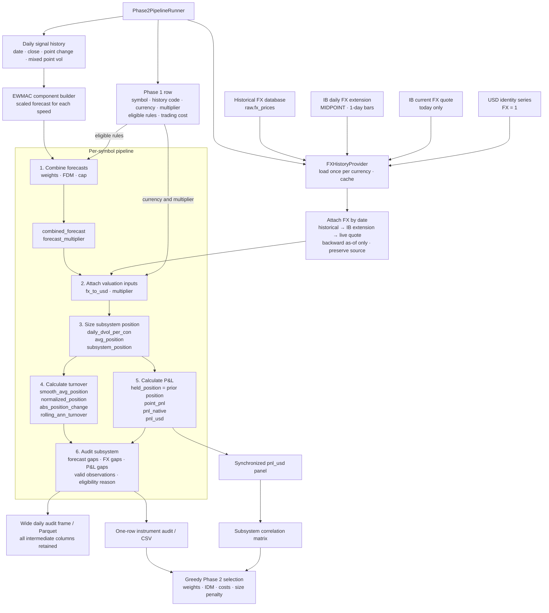

# Pysystemtrade executable costs and instrument selection

Research date: 2026-10-04.

This is the executable-universe and static-selection companion to
[pysystemtrade-data.md](pysystemtrade-data.md). Its phases are independent of
the data import, hybrid-history, and carry phases in that document:

1. Phase 1 resolves executable contracts and audits cost, risk, granularity,
   rule affordability, and broker availability.
2. Phase 2 selects a diversified static instrument set from the Phase 1
   candidates using the AFTS greedy procedure.

The data report remains authoritative for source lineage, history construction,
overlap validation, and the data-side implementation phases. This document
owns executable economics and instrument selection.

## Phase 1: Executable-contract cost and granularity diagnostic

`futures-cost-risk` is the executable-universe companion to the broad Carver
research panel. It resolves the dated IBKR contract that would actually be
traded and reports its current notional, Carver mixed volatility, daily and
annual dollar volatility per contract, configured
commission, live and historical bid/ask width when available, and one-way cost
as a fraction of annual dollar volatility.

The default volatility source is the full roll-neutral pysystemtrade history.
The shared core helper calculates the *Advanced Futures Trading* specification:
an `adjust=True` EWM standard deviation of daily point changes with span 32,
an `adjust=True` EWM mean of that fast volatility with span `10 × 256`, and
`mixed_vol = 0.7 × fast_vol + 0.3 × slow_vol`. The output exposes both
components, their blend, observation count, and effective history years. In
the current 252-instrument panel every history produces a mixed estimate, but
93 have fewer than ten years of fast-volatility observations and are labelled
accordingly rather than treated as fully warmed up.

Percentage volatility divides historical mixed point volatility by the raw
current-contract price at the same history endpoint (`ref_price`).
For a live audit the fast return-volatility component comes from up to one year
of daily bars on today's resolved dated IB contract, while the slow component
is Carver's long-history point-volatility anchor divided by its contemporaneous
price. The 70/30 blend is then applied to today's IB price. If the dated request
does not produce the minimum observations, the complete Carver mixed return
volatility is scaled to today's price and flagged as a fallback. Thus
`daily_pt_vol`, dollar volatility, and notional share a current
price level, while `ref_mixed_point_vol` remains the auditable historical
input. `ref_cur_price_ratio` and `vol_source` expose the handoff.

IB dated (`--vol-source dated`) and continuous (`--vol-source continuous`)
history remain explicit comparison modes. Continuous is never the default
because its adjustment and roll behavior disagrees with the repository's
Globex construction.

The bundled Carver-to-IB registry contains all 584 configured futures mappings
and covers all 252 usable histories. It retains Carver instrument code,
`IBSymbol`, exchange, broker currency, broker multiplier, price magnifier, and
weekly-expiry flag. The packaged file is pinned to upstream pysystemtrade
commit `b4a25e6e1e33a54a3ecfb45c0f6db5e2b60b84f8`. Candidate mapping does not imply that the connected US
IBKR account has trading permission or market data: live qualification writes
that result separately. The effective IB point value
`IBMultiplier / priceMagnifier` matches imported `point_size` for all 584
mappings.

The cost report deliberately retains all 252 usable histories, including rows
excluded from pooled signal calibration, and adds seven local execution
overlays absent from Carver: the CBOT grain micros `MZC`, `MZS`, `MZW`, `MZL`,
and `MZM`, plus the Treasury micros `MTN` and `MWN`. The resulting 259 rows
include economic family, roll policy, duplicate group,
pooling role, representative, default-pool inclusion, decision basis, and
`history_instrument_code`. This lets the same CSV compare execution economics
without allowing size variants to multiply their weight in the EWMAC
normalization sample.

The overlays retain their own IB symbols, raw broker multipliers, effective
point values, and commissions. Their research history and roll transactions
come from a compatible Carver parent: `MZC→CORN_mini`,
`MZS→SOYBEAN_mini`, `MZW→WHEAT_mini`, `MZL→SOYOIL`,
`MZM→SOYMEAL`, `MTN→US10U`, and `MWN→US30`. The first three use the
all-listed-month mini history rather than the full contract's seasonal
November/December policy. `MTN` follows the price-quoted Ultra 10-Year (`TN`),
not standard 10-Year (`ZN`), while `MWN` follows Ultra Bond (`UB`). Because
Carver has no observed spread for these micros, an overlay's spread stays
unknown until IB supplies historical BID_ASK data or a snapshot; it never
inherits the parent's spread silently.

The default cost audit estimates separate Carver-style research baselines for
EWMAC 4/16, 8/32, 16/64, 32/128, and 64/256 from the 228 reviewed
representatives. Each rule reuses its mapping- and range-keyed EWMAC cache,
applies the causal pooled forecast scalar, delays each forecast by one
observation, and earns the canonical matched-contract point change against
lagged 70/30 mixed point volatility. Mean, median, history-weighted, and
observation-stacked pre-cost Sharpes remain diagnostics. They do not determine
whether a rule or instrument is affordable.

Forecast turnover is estimated separately for every representative and speed as
`256 × mean(abs(change in forecast)) / 0.5`, then pooled with Carver's
history-length weighting. Each execution row uses that speed's pooled rule
turnover, its own one-way spread, commission, point value, FX conversion, and
current-price-scaled dollar volatility. The selected research representative's
current configured hold cycle supplies `ann_rolls`; full-history and recent
observed rates remain audit fields and never silently override that
configuration. `ann_trades` is Carver's one-way rule turnover and excludes
rolls. The report keeps the two cost streams separate instead of inventing a
combined transaction count:

```text
trade_sr
    = selected one-way cash cost / annual dollar volatility

roll_sr
    = estimated complete roll cost / annual dollar volatility

trade_ann_cost_sr(speed)
    = trade_sr × ann_trades(speed)

roll_ann_cost_sr(speed)
    = roll_sr × ann_rolls

tot_ann_cost_sr(speed)
    = trade_ann_cost_sr(speed) + roll_ann_cost_sr(speed)
```

#### Turnover units and AFTS reconciliation

The Phase 1 CSV uses `ann_trades` for Carver's one-way strategy trades and
`ann_rolls` for complete roll events. It deliberately has no `total_tx`
column. Under the Carver-style `calendar_spread` roll-cost model:

```text
trade_sr = (one spread crossing + one commission) / annual dollar volatility
roll_sr = (one spread crossing + two commissions) / annual dollar volatility
```

A physical futures roll has two one-way legs: close the old contract and open
the new contract. A calendar-spread order executes both legs with one spread
crossing but pays commission on both legs. That complete event cost is
contained in `roll_sr`; `ann_rolls` remains an event count and is never doubled
or added to `ann_trades`. The selected outright half-spread is the fallback
proxy for the calendar-spread execution cost until a direct spread quote is
available.

The selected event rate is now the number of months in the current configured
hold cycle, matching pysystemtrade's `rolls_per_year_in_hold_cycle()`. The CSV
also reports full-history and recent observed rates, their differences from
configuration, the recent window, and `ref_strategy_roll_rate_audit`. Fallback
to recent and then full-history observation occurs only when the configured
cycle is unavailable and is explicit in `ref_strategy_roll_rate_source`.

This distinction corrected a real undercount in the earlier report.
`CORN_mini` and its `MZC` overlay used 132 transitions over the entire
1970–2024 history, or `2.4622` events/year, even though the current `HKNUZ`
cycle and every complete 2016–2023 year imply five. For MZC 64/256, the
forward inputs are therefore `ann_trades=5.5685` and `ann_rolls=5`; its annual
cost is `trade_sr × 5.5685 + roll_sr × 5`. Full-size `CORN` retains its
configured annual `Z` cycle and therefore one roll event/year.

#### CORN roll-policy performance ablation

The EWMAC performance columns must be interpreted separately from the forward
roll-cost correction. A full-history `CORN_mini` score mixes two materially
different histories: the early sample rolled mostly between September and
December, while every complete 2016–2023 year used the current five-month
`HKNUZ` path. `MZC` borrows that mini history. A high full-history mini score
therefore cannot by itself justify either two or five future rolls.

[`pysystemtrade_corn_roll_ablation.py`](../scripts/pysystemtrade_corn_roll_ablation.py)
calculates all five EWMAC forecasts using the complete history for warm-up,
then evaluates full-size annual-December `CORN` and `CORN_mini` before and
after 2016. These are matched-era comparisons of the two available held
contract paths, not a causal same-market roll experiment:

| Rule | Pre-2016 annual Z SR | Pre-2016 early-mini SR | Mini minus annual | 2016–2024 annual Z SR | 2016–2024 five-roll mini SR | Mini minus annual |
|---|---:|---:|---:|---:|---:|---:|
| 4/16 | 0.255 | 0.443 | +0.188 | 0.028 | 0.034 | +0.006 |
| 8/32 | 0.396 | 0.538 | +0.142 | 0.226 | 0.168 | -0.058 |
| 16/64 | 0.439 | 0.537 | +0.098 | 0.332 | 0.229 | -0.102 |
| 32/128 | 0.333 | 0.379 | +0.046 | 0.349 | 0.258 | -0.091 |
| 64/256 | 0.175 | 0.169 | -0.006 | 0.265 | 0.234 | -0.031 |

The result explains the apparent full-history advantage of `CORN_mini`: it is
concentrated in the long early regime, especially in the fast and medium
rules. In the approximately eight-year post-2016 sample, annual December is
ahead for 8/32 through 64/256, but the paired mini-minus-annual differential
Sharpes are only `-0.065`, `-0.118`, `-0.117`, and `-0.004`. Their approximate
standard errors are about `0.35`; the evidence is far too weak to infer that
annual December is the superior current strategy. The post-2016 daily P&L
correlations remain 0.78–0.85, so this is mostly a close variant comparison.

Changing the roll allowance also does not change MZC's rule set in the
referenced live audit. At its `0.0054` one-way SR cost per trade and the pooled
turnovers used by that report, 16/64 costs approximately `0.089`, `0.100`, and
`0.132` SR units with one, two, and five annual rolls respectively; all pass
the `0.15` ceiling. Rule 8/32 costs approximately `0.162` even with only one
roll, so an annual contract would not make it eligible. The current five-roll
MZC still retains 16/64, 32/128, and 64/256.

The operational default should therefore remain the configured five-month
MZC/`CORN_mini` path. Annual December is useful as a sensitivity benchmark,
not as a selected replacement. A causal roll-policy choice requires building
same-date Z-only, U/Z, and HKNUZ histories from contract-level prices and
comparing them net of month-specific spreads and liquidity. The two imported
held paths cannot isolate roll policy from contract size, construction, and
era effects. The source-neutral Globex provider now supports these
contract-level counterfactuals through explicit, run-local roll-policy
overrides; the next performance comparison should use those generated paths,
not add another raw market-data table.

This Phase 1 calculation matches pysystemtrade's current **rule affordability**
contract: [`get_SR_cost_for_instrument_forecast`](https://github.com/pst-group/pysystemtrade/blob/b4a25e6e1e33a54a3ecfb45c0f6db5e2b60b84f8/systems/accounts/account_costs.py#L14-L33)
adds forecast transaction cost to holding cost, and
[`get_SR_holding_cost_only`](https://github.com/pst-group/pysystemtrade/blob/b4a25e6e1e33a54a3ecfb45c0f6db5e2b60b84f8/systems/accounts/account_costs.py#L183-L190)
defines holding turnover as `2 × rolls_per_year`. Its cost per trade is
one-way; multiplying one-way turnover by a round-trip cost would recreate the
historical factor-of-two error noted in the
[pysystemtrade changelog](https://github.com/pst-group/pysystemtrade/blob/b4a25e6e1e33a54a3ecfb45c0f6db5e2b60b84f8/CHANGELOG.md).

The published AFTS static selector uses a different cost contract. Its
[`calculate_trading_cost`](https://github.com/pst-group/pysystemtrade/blob/b4a25e6e1e33a54a3ecfb45c0f6db5e2b60b84f8/systems/provided/static_small_system_optimise/optimise_small_system.py#L292-L300)
multiplies combined `subsystem_turnover` by one-way SR cost per trade; it
does not call `get_SR_cost_given_turnover` and therefore does not add a
separate holding-roll term. Phase 2 must reproduce that definition for its
exact AFTS baseline. It should also report a clearly labelled
`afts_plus_rolls` sensitivity using
`trade_sr × subsystem_turnover + roll_sr × ann_rolls`. The Phase 1 per-rule total is
neither of those Phase 2 inputs: it screens individual rules before their
forecasts are combined.

Each rule passes when total annual SR cost is no greater than `0.15`, the AFTS
rule-selection ceiling. `--rule-cost-limit-sr` exposes that fixed SR-unit
threshold. An instrument remains eligible when at least one speed passes; it
is not compared with an empirically fitted individual or pooled Sharpe. The
older one-third-of-pooled-Sharpe reports are retained as historical artifacts
but are no longer the selection contract.

Eleven usable histories carry Carver's `IgnoreWeekly` flag. The generic live
resolver does not guess among their weekly/daily expiries; it retains their
offline cost/risk rows but marks live qualification unavailable until a
product-specific expiry filter is supplied.

An IB-connected phase-one audit requests `BID_ASK` history on the exact dated
contract. `--spread-duration` is passed to
`IBPySync.get_historical_bars(duration=...)` independently of the daily-price
history duration and defaults to `5 D × 15 mins`. A 60-second timeout stops
all further historical probes for that contract. Delayed data can step down
after an immediate non-timeout failure, but a timeout never cascades into more
requests. The successful duration and bar size remain explicit report fields.
Spread history uses RTH by default; `--spread-all-hours` opts into the entire
futures session. For IB `BID_ASK` bars, `open` is average bid and `close` is
average ask, so `close - open` is the full quoted point spread for that bar.
The selected execution estimate is half the median width over the five-day
window. This is robust to repeated stale quotes from the period before a dated
contract becomes actively traded; mean and p90 remain visible as liquidity
diagnostics. The CSV reports **all** spread statistics as one-way points:
`ib_hspread_mean_pts`,
`ib_hspread_median_pts`, `ib_hspread_p90_pts`, `snap_spread_pts`,
`ref_spread_pts`, and `spread_pts` are therefore directly
comparable and must not be halved again. Observation count, date range,
successful bar size, attempts, and failures are retained under the compact
`ib_hspread_*` prefix.

Timestamped Phase 1 filenames and the CSV fields `report_ts_ct`,
`snap_quote_timestamp_ct`, `ib_hspread_start`, and `ib_hspread_end` use the
daylight-saving-aware `America/Chicago` timezone. This aligns report review
with CME hours; each ISO timestamp retains its explicit `-05:00` or `-06:00`
offset. Raw IB bar timestamps are not mutated.

The current quote is an availability preflight as well as a price source. In
automatic mode the audit retains errors from every attempted mode for audit,
but eligibility for history is determined only by the quote attempt ultimately
selected. Thus an initial live error `354` does not veto history when the next
type-3 delayed request returns usable data. Before any historical call, both a
type-3 delayed quote and a type-4 delayed-frozen quote explicitly reset IB to
type 3, because delayed—not delayed-frozen—is the historical-data mode. The
report separates `snap_error_codes` (all attempts) from
`snap_selected_error_codes` and records `ib_hist_mkt_data_type`.

Quote and historical availability are not identical for delayed data. The AEX
mini, for example, can return `10168` from delayed `reqMktData` while a type-3
`reqHistoricalData(..., whatToShow="BID_ASK")` request succeeds. Consequently
`354`, `10167`, and `10168` still describe the selected quote attempt but no
longer veto a type-3 historical probe for a qualified contract. Error `200`
continues to block the probe because it means the contract itself is invalid.
`ib_hist_requests_allowed` therefore means the audit may attempt the
endpoint, not that IB has already proven the data available. Actual timeout or
empty-history failures remain recorded and fall back to the snapshot or
configured Carver spread. With the default `pysystemtrade` volatility source,
failed recent IB history similarly falls back to the Carver mixed point
volatility scaled as a return at the Carver reference price.

If delayed `reqMktData` supplies no mark, the audit first requests one day of
five-minute `BID_ASK` history and uses the midpoint of the latest time-average
bid and ask; daily `TRADES` is the secondary mark fallback. This permits the
AEX mini historical path demonstrated by IB even though its delayed snapshot
returns `10168`.

If dated history is unavailable, the same IB root's continuous future is tried
as a spread-only fallback. It never supplies the executable contract or signal
history. A dated-contract timeout suppresses this second historical attempt,
because retrying the same service through a continuous contract normally adds
two more 60-second waits rather than new information. Non-timeout failures can
still use the continuous fallback. A current snapshot is the next fallback;
Carver's configured one-way
spread is last. Missing bid/ask data remain **unknown**, never zero. A Carver
zero is labelled `static_config_zero_spread`, still includes commission, and
must not be interpreted as evidence of free live execution. Historical IB
spread requests require entitlements and are pacing-sensitive, so a complete
259-row collection should be run deliberately rather than as an incidental
notebook refresh.

IB error `162` with “API historical data query cancelled” after the wrapper's
60-second timeout is not an entitlement response. The asynchronous request has
timed out and the cancellation is the server acknowledgement for that request
ID. These rows need smaller, paced requests or a retry; they must not be
labelled as missing subscriptions. All observed timeout spellings (`timeout`,
`timed out`, and `query cancelled`) suppress the continuous-contract retry so
one failed dated request does not cascade into more 60-second waits. When a
continuous spread fallback is appropriate after a non-timeout failure, its
currency is inherited from the qualified dated contract or the instrument's
native currency; an empty Carver broker-currency field must not default a EUR
Eurex contract such as GBM to USD.

Carver's `BB3M` history remains usable for research, but its mapped CME BSBY
future is not a current execution candidate: CME converted and permanently
delisted the contract in October 2024. The live audit therefore records BB3M as
retired without sending an invalid `BSBY` security-definition request to IB.

Execution permission is local account metadata, not Carver source metadata.
The engine's `ibkr_us` eligibility profile marks the Carver `SGX` instrument
(IB root `STI`) `exec_elig=false` with reason
`ibkr_us_product_restriction`. Its history remains in the research and forecast
scalar pools, and its cost row remains auditable; the asset-class ranking helper
excludes explicitly restricted rows by default. `ib_avail` continues to
describe contract/data qualification only and must not be read as permission to
trade.

Phase one also ranks candidates within each asset class separately by one-way
SR cost, current notional, and current annual dollar volatility. The report
assigns rank 1 to the lowest value: the cheapest risk-adjusted trading cost,
smallest contract risk, and smallest notional appear first in their respective
rankings.
The report includes the notional and annual dollar volatility of four contracts and
`min_capital_full_weight_idm1 = 4 × annual dollar vol / target vol`. This is a
capital-independent, one-instrument lower bound rather than the portfolio
affordability result.

The portfolio scenario defaults to `$100,000`, `IDM=1`, four average contracts,
and at least 15 ordinary instruments. Fifteen is the lower end of Carver's
[15-to-30 instrument guidance](https://qoppac.blogspot.com/2021/06/static-optimisation-of-best-set-of.html)
for adequate futures diversification. Its equal-weight risk budget is
`capital × target vol × IDM / minimum main instruments`; the CSV reports the
resulting average contracts and the capital required to reach four. The seven
main asset classes are `Equity, Ags, Vol, OilGas, FX, Metals, Bond`. `Housing`,
`Sector`, and `Other` are special additions: they retain affordability metrics
but do not satisfy the minimum-15 breadth count. Portfolio construction should
first try to cover all seven main classes, then fill the remaining main slots;
coverage is a preference when contract granularity makes a class infeasible.
These figures are deliberately a Phase 1 stress scenario. Four contracts and
15 instruments must not become simultaneous hard admission gates in Phase 2:
that would reject diversification before allowing its higher IDM to reduce the
capital needed per instrument.

Rule-cost screening uses the same `ann_dvol` as contract-risk sizing and the
liquidity screen. There is no separate cost-volatility selector or duplicate
cost dollar-volatility field. Consequently `trade_sr` and `roll_sr` can always
be reproduced directly from the reported cash costs and `ann_dvol`.

```bash
.venv/bin/futures-cost-risk \
  --instruments all-pysystemtrade \
  --vol-source pysystemtrade \
  --spread-duration '5 D' \
  --fast-vol-span 32 \
  --slow-vol-years 10 \
  --slow-vol-weight 0.30 \
  --cost-ewmac-fast-spans 4,8,16,32,64 \
  --rule-cost-limit-sr 0.15 \
  --affordability-capital-usd 100000 \
  --affordability-idm 1 \
  --affordability-min-contracts 4 \
  --affordability-min-main-instruments 15 \
  --affordability-main-asset-classes Equity,Ags,Vol,OilGas,FX,Metals,Bond
```

Use `--skip-ewmac-cost-baseline` only when a quick volatility/contract audit
is wanted without the pooled strategy calculation. EWMAC speeds,
mixed-volatility inputs, scalar warm-up, and the SR cost ceiling have separate
`--cost-ewmac-*` and `--rule-cost-limit-sr` flags. Their defaults match the five
AFTS EWMAC speeds and the 32-session/ten-year/30% mixed volatility, while
remaining independently overridable for research.

Load the newest timestamped Phase 1 report and show the top five instruments
in every asset class from a notebook with:

```python
from derivatives_bt_engine.data.futures_cost_rankings import (
    display_asset_class_rankings,
    load_latest_phase1_cost_report,
    top_n_by_asset_class,
)

report_path, phase1 = load_latest_phase1_cost_report(".")
print(report_path)

rankings = top_n_by_asset_class(phase1, n=5, rank_by="cost")
display_asset_class_rankings(rankings)
```

Set `rank_by` to `"affordability"` or `"notional"` for the other Phase 1
rankings. Pass `asset_classes=["Equity", "Rates"]` to show selected classes,
or `columns=None` to retain all report columns in each returned frame.

### Phase 1 operational modes and public output

`--offline` writes the complete 259-row comparison without connecting to IB.
Prices and volatility then end at the imported Carver history boundary, live
spreads remain null, and non-USD conversions use the latest FX observation in
that database. Omit `--offline` to qualify current IB contracts and request
current quotes; this is the step that tests real account availability.

An online audit requests each required cash-FX pair from IB once before the
futures loop. `cur_fx_to_usd`, `cur_fx_src`, `cur_fx_pair`,
`cur_fx_mkt_data_type`, and `cur_fx_asof` identify the conversion actually
used for notional, dollar volatility, and costs. The imported Carver rate is
retained later as `ref_fx_to_usd`/`ref_fx_asof`. If IB cannot supply the pair,
the reference rate becomes the selected `cur_fx_to_usd` and
`cur_fx_src=pysystemtrade_reference_fallback` makes that substitution
explicit. Contract construction, quote fallback, rejection handling, and the
USD quotation convention live in `IBPySync`: AUD/EUR/GBP/NZD use `CCYUSD`;
other currencies use `USDCCY` and are inverted, with legacy `MXP` mapped to
IB's current `MXN` code. The cost report does not probe both orientations.

The public CSV is ordered around one primary calculation path, so it does not
repeat a `selected_*` prefix. Current price, FX, volatility, dollar risk,
spread, cash cost, and SR cost come first. Point-in-time quote alternatives use
`snap_*`; unused Carver inputs and fallbacks use `ref_*` at the diagnostic
tail. Primary `notional` and `dvol` values are USD per row contract; native
amounts retain `_native`. Common abbreviations include `con`, `instr`, `exec`,
`elig`, `ann`, `dvol`, `sr`, `pct`, `avg`, `min`, `max`, and `n`.

For an IB-connected audit, the command defaults to `--market-data-type auto`:
it tries real-time (`1`), then delayed (`3`), then delayed-frozen (`4`), and
stops at the first valid bid/ask. The CSV records both the successful mode and
the attempted sequence. Explicit `live`, `delayed`, and `delayed-frozen`
settings disable fallback. IB errors 354/10168 indicate quote entitlement,
not a failed futures contract
mapping. Rejected requests are recorded in `snap_error_codes` and cleaned up
locally without a redundant cancellation request. Contract-definition lookups
are bounded to eight seconds by default (`--contract-details-timeout`) so a
stale mapping cannot stall the broad-universe audit for the wrapper's normal
30-second request timeout.

Saved CSV reports round monetary notional, commission, cash-cost, and dollar-
volatility fields to two decimal places. Other floating-point diagnostics are
rounded to four decimal places; identifiers and observation counts are left
unchanged.

### Phase 1 liquidity and Phase 2 pre-filter

The IB-connected audit also saves the exact executable contract's mean daily
volume over its latest 20 valid daily `TRADES` bars as `avg_daily_volume`.
This is deliberately contract volume, not volume borrowed from the signal
history. Risk normalization reuses the selected mixed annual dollar volatility
already used for production sizing; the screen does not introduce a separate
short-window volatility definition:

```text
risk_traded_usd_day = init_capital_usd * target_vol * liquidity_ann_trades / 250
mkt_risk_vol_usd_day = avg_daily_volume * ann_dvol
pct_mkt_volume = 100 * risk_traded_usd_day / mkt_risk_vol_usd_day
```

This makes the article's `$1.25 million` a scenario result, not a universal
floor. With `$500,000`, a 25% target, and 25 annual trades, daily strategy risk
traded is `$12,500`; a 1% participation limit therefore requires at least
`$1.25 million` of market risk volume per day. The later `$25,000` Eurodollar
numerator in the article is inconsistent with that construction; the report
uses the stated `$12,500` calculation.

The 100-contract condition remains an independent construction check. Passing
the percentage test does not rescue a contract with 100 or fewer contracts of
average daily volume, even if each contract has very large annual dollar
volatility.
The defaults are `--min-daily-volume 100`, `--max-market-volume-pct 1`,
`--liquidity-ann-trades 25`, `--volume-lookback-days 20`,
`--initial-capital-usd 100000`, and `--target-vol 0.20`.

Phase 1 retains every row for audit and adds separate cost, one-contract risk-
size, contract-volume, and relative-risk-volume flags. `phase2_elig` also
requires at least one affordable EWMAC rule, an allowed execution profile, and
a qualified IB contract. `phase2_excl` records all failed gates. The
`phase2_search_universe()` notebook helper reads only eligible rows before the
greedy search; it does not destructively condense the saved audit. The size
gate compares the production mixed annual dollar volatility per contract with
`init_capital_usd * target_vol`; futures notional is reported but is not a
capital-eligibility test.

`sel_bucket` mirrors Carver's three-way triage. Missing executable
price, FX, multiplier, or 20-day close/volume data is `dont_add_no_data`;
there is no numeric substitute for a missing data subscription. Rows with
data that fail cost, dollar-vol size, or either liquidity gate are
`add_later`. Rows passing those four numeric gates are `add_first`.
`phase2_elig` is intentionally narrower than `add_first`, because the
actual search must also respect the EWMAC-rule and execution-family checks.

### Phase 1 to Phase 2 pipeline

The saved Phase 1 CSV is the durable handoff, not a throwaway display table.
Keep every audited row in that file so exclusions remain reproducible, then
derive the smaller search universe from it:

```text
pysystemtrade histories + instrument metadata + local execution overlays
    -> per-rule EWMAC performance, turnover, rolls, and cost eligibility
    -> resolve the exact dated IB contract
    -> current price and FX, executable spread and commission
    -> 20-day mean contract volume
    -> mixed production volatility and one-contract dollar risk
    -> Phase 1 gates, sel_bucket, phase2_elig, and phase2_excl
    -> full auditable Phase 1 CSV
    -> phase2_search_universe(CSV)
    -> combined forecast and subsystem return for each surviving instrument
    -> trial-book correlations, handcrafted weights, and IDM
    -> portfolio-specific positions, turnover, cost, and market participation
    -> greedy AFTS selection with core-class coverage and score tolerance
```

#### Target Phase 2 pipeline runner

The complete path should have one explicit runner that coordinates narrow
data and domain stages. Each stage appends the columns it owns to the same
daily frame; it must not hide intermediate values in a private calculation.
In particular, forecast combination does not own FX retrieval, position
sizing does not own P&L conversion, and the audit does not reconstruct values
that should already be present in the daily frame.



The same ownership in terminal-readable form is:

```text
1. Load Phase 1 row and daily signal history.
2. Build and combine eligible EWMAC forecasts.
3. Load historical FX once per currency; extend it with IB only after the
   stored series ends; attach multiplier and date-aligned FX to the frame.
4. Convert mixed point volatility into average and desired subsystem positions.
5. Calculate turnover from normalized desired-position changes.
6. Lag the desired position and calculate point, native-currency, and USD P&L.
7. Audit the wide daily frame and write the compact instrument summary.
8. Align valid USD subsystem P&L, estimate correlations, and run the greedy
   portfolio search.
```

The Phase 1 `cur_fx_to_usd` value is a point-in-time cost and sizing snapshot;
it must never be filled backward through the historical subsystem frame. The
FX history provider owns the database-to-IB splice and records the source and
observation date of every rate. USD receives an explicit identity series.

Phase 2 Step 1 is deliberately only a persisted-gate selection. It does not
connect to IB and does not recalculate volume, volatility, cost, or any other
Phase 1 metric. Run:

```bash
futures-select-phase2 --report-dir results
```

The command loads the newest Phase 1 IB CSV and saves
`pysystemtrade_phase2_step1_<timestamp>.csv` beside it. The output contains
selected instruments only. A row must have saved `cost_elig`, `size_elig`,
`liq_elig`, `data_elig`, rule eligibility, execution eligibility, and
`phase2_elig` flags equal to true, plus `ib_avail=contract_qualified`. The CSV
retains the instrument and executable-contract identifiers, `ann_dvol`, raw
volume and market-risk-volume values, liquidity percentages and limits, and
the saved gate flags needed to audit why each row entered the Phase 2 search.
It also repeats the validated run-level inputs `init_cap_usd`, `target_vol`,
`cost_lim_sr`, `rule_cost_lim_sr`, `liq_ann_trades`, `liq_days`,
`min_daily_volume`, and `max_pct_mkt_volume` on each selected row. Step 1 fails
if any of these are absent, null, or inconsistent across the Phase 1 report.
Use `--input <phase1.csv>` to select a particular audit and `--output <path>`
to choose the exact intermediate filename.

Add `--complete` to continue from that saved Step 1 universe through forecast
combination and the unconstrained greedy AFTS baseline. The command writes:

- `pysystemtrade_phase2_forecast_audit_<timestamp>.csv`, with component and
  combined null/non-finite counts, valid dates and observations, FDM, combined
  turnover, cost, and the precise exclusion reason;
- `pysystemtrade_phase2_forecasts_<timestamp>.parquet`, containing the daily
  component forecasts, combined forecast, validity flag, normalized position,
  and subsystem return for direct inspection;
- `pysystemtrade_phase2_subsystem_returns_<timestamp>.parquet`, the synchronized
  return panel used by the bounded correlation estimator;
- `pysystemtrade_phase2_trials_<timestamp>.csv`, one row per greedy trial; and
- `pysystemtrade_phase2_selection_<timestamp>.csv`, the last accepted book.

In the final selection CSV, `net_sr` is an instrument-level input to the
portfolio score: the common gross SR assumption less that instrument's annual
combined-forecast trading cost and its final-book granularity penalty. It is
not the book score when the ranked instrument was added. The accepted rows in
the trials CSV record that sequence: `book` is the hypothetical portfolio and
`score` is its portfolio-level score at that iteration.

All Phase 1 and Phase 2 public CSVs use the shared report formatter at the
write boundary. USD amounts are rounded to cents, reproduction-sensitive FX
and return-volatility rates to six decimal places, and other floating-point
diagnostics to four. Forecast and synchronized-return Parquet files retain
full calculation precision.

Warm-up nulls are expected and recorded. A candidate is excluded before the
search when it has fewer than `--min-forecast-obs` fully valid observations,
has a null or non-finite component after its first fully valid row, produces a
non-finite combined forecast or turnover, or lacks enough synchronized
subsystem returns for correlation estimation. The daily Parquet makes the
summary gate reproducible rather than hiding a missing forecast behind an
aggregate score.

For interactive inspection of one instrument's history, pooled normalization,
raw momentum, and component forecasts without running either report, use the
[pysystemtrade EWMAC notebook workflow](pysystemtrade-ewmac-notebook.md).

The Phase 1 `liquidity_ann_trades=25` calculation is Carver's conservative
single-instrument scenario. It is useful for coarse triage, but it is not the
final capacity estimate for a Phase 2 trial book. Phase 2 must first combine
the surviving rules into the instrument forecast and measure the resulting
subsystem turnover. It must then use the trial weight and trial IDM to compute
that instrument's risk allocation and daily risk traded. Do not average or sum
the individual rule turnovers as a substitute for the combined subsystem.

Likewise, the Phase 1 one-way `trade_sr <= 0.01` test is an initial cost screen.
The Phase 2 score uses the combined subsystem turnover:

```text
instr_risk = capital * target_vol * weight * IDM
risk_traded_day = instr_risk * subsystem_turnover / 250
pct_mkt_volume = 100 * risk_traded_day / mkt_risk_vol_usd_day
annual_trade_cost_sr = trade_sr * subsystem_turnover
```

Add `roll_sr * ann_rolls` only in the separately reported production-cost
sensitivity. The baseline AFTS score excludes that holding-roll allowance, as
described below. Thus Phase 1 answers “is this executable contract worth
carrying into the search?”, while Phase 2 answers “does this contract fit this
particular diversified trial book?”

The initial combination policy uses the five ordinary EWMAC speeds only:

```text
4/16=5%, 8/32=15%, 16/64=20%, 32/128=30%, 64/256=30%
```

This gives 60% to `32/128` and `64/256` and 40% to the faster three rules. A
rule removed by the Phase 1 cost gate receives zero weight and the remaining
weights are renormalized; for example, `16/64,32/128,64/256` becomes
`25%,37.5%,37.5%`. Each component is causally scaled and capped first. The
weighted forecast then receives a correlation-estimated FDM,
`min(2.5, 1/sqrt(w' C w))`, and is capped again. FDM is separate from the rule
weights and is not baked into their reported percentages.

## Phase 2: Iterative AFTS instrument selection

Carver's [static instrument-selection
algorithm](https://qoppac.blogspot.com/2021/06/static-optimisation-of-best-set-of.html)
is a greedy portfolio search, not a sort followed by a fixed contract-count
filter. At each iteration it tries every unused instrument as the next member,
rebuilds the hypothetical portfolio, and keeps the candidate with the highest
expected portfolio Sharpe ratio. This is the appropriate baseline for Phase 2.

The Phase 1 pre-selection filters are hard for entry to the search: a candidate
needs usable history, price, FX, contract multiplier, annual dollar volatility,
at least one cost-eligible rule, one-way `trade_sr <= 0.01`, and a qualified
contract allowed by the selected broker profile. It must pass both the
100-contract daily volume floor and the coarse relative market-risk
participation calculation above, as described in
[Adding new instruments](https://qoppac.blogspot.com/2021/05/adding-new-instruments-or-how-i-learned.html).
Every Phase 2 trial then recalculates turnover, position size, and market
participation using the combined subsystem and the trial book's weight and IDM;
the fixed 25-trade Phase 1 scenario must not replace that calculation.
Full, mini, and micro contracts that express the same signal are one economic
family: normally select at most one execution route, unless the report already
establishes a materially distinct contract or roll path. An execution overlay
may borrow the representative instrument's signal history, but retains its own
multiplier, spread, commission, price, and resulting trading cost.

For a trial book `B`, correlations must be estimated from volatility-normalized
**subsystem returns after the forecasting decision**, using each candidate's
eligible rule mix. Raw price-return correlations are not the portfolio input.
Use the same robust missing-data treatment and bounded exponentially weighted
correlation machinery as the allocation layer. The initial implementation
should reproduce Carver's correlation-only handcrafted weights; existing ERC
and HRP weights are useful sensitivity variants, but should not be labelled as
the AFTS handcraft method.

For normalized subsystem returns, let `H` be the correlation matrix and `w`
the trial risk weights, summing to one. Recalculate the diversification
multiplier for every trial book:

```text
IDM(B) = min(2.5, 1 / sqrt(w' H w))
```

For candidate `i`, the position at the maximum absolute forecast of 20 is:

```text
P_i = capital * target_vol * w_i * IDM(B) / annual_dollar_vol_i * (20 / 10)
```

The final factor is two because the AFTS average absolute forecast is 10.
Following Carver, assign an effectively infinite size penalty when `P_i < 0.5`
contracts; otherwise:

```text
size_penalty_i = 0.125 / P_i**2
net_SR_i = 0.5 - annual_trading_cost_SR_i - size_penalty_i
portfolio_score(B) = (w . net_SR) / sqrt(w' H w)
```

The constant gross Sharpe assumption of 0.5 is intentional. Instrument-specific
pre-cost backtest performance must not decide which markets survive. The exact
AFTS annual trading-cost term must come from the combined subsystem turnover
produced by the eligible-rule mixture:

```text
afts_annual_trading_cost_SR
    = trade_sr × subsystem_turnover
```

Here `subsystem_turnover` follows pysystemtrade's `turnover(x, y)` definition.
`x` is the unbuffered combined subsystem position. Its EWMAC forecast is not
smoothed again. The function applies an EWM with `com=250` only to `y`, the
time-varying average-position/volatility denominator, before measuring changes
in `x / y`. The implementation calls this parameter
`average_position_ewm_com` to avoid implying forecast smoothing.

The separate default `buffer_size=0.10` is a no-trade band, not a smoothing
parameter. With forecast buffering, the band is 10% of average position and a
breach trades to the nearest edge. The published static-small-system AFTS code
uses `system.accounts.subsystem_turnover()`, which measures the unbuffered
subsystem position, so the Phase 2 baseline does the same. A buffered
portfolio-turnover sensitivity may be reported separately; it must not silently
replace the AFTS cost input.

Do not sum the eligible rules' individual turnovers: forecast combination and
the changing volatility scalar determine the resulting subsystem turnover.
Do not feed the Phase 1 `tot_ann_cost_sr` into this baseline either, because it
includes a
separate two-leg holding-roll allowance that the published AFTS selector omits.
Report the more conservative production sensitivity separately:

```text
afts_plus_rolls_annual_cost_SR
    = trade_sr × subsystem_turnover + roll_sr × ann_rolls
```

Both variants use the current one-way definition of `trade_sr`. This preserves
the observed corn result at the
screening stage: a higher-cost full or mini contract can lose its fast EWMAC
rules, while a cheaper micro can retain more rules, without either outcome
being hard-coded by symbol. Phase 2 then scores each surviving execution route
with combined subsystem turnover, not the sum of those rule-screening costs.

Seed the loop by ranking individual instruments with the same net-SR formula,
but a configured nominal starting weight and `IDM=1`. Carver uses a 5% weight
cap for a larger account and explicitly raises it for small accounts (20% in
his `$100,000` example), so `starting_weight_cap` must be an exposed Phase 2
parameter rather than a buried constant. The baseline loop is:

```text
eligible = hard_filter(phase1_candidates)
selected = [best_single_candidate(eligible, starting_weight_cap)]
best_seen = 0.0  # published AFTS loop updates this from the first n+1 trial

while unused candidates remain:
    trials = []
    for candidate in unused:
        book = selected + [candidate]
        H = subsystem_return_correlations(book)
        w = handcrafted_risk_weights(H)
        idm = min(2.5, 1 / sqrt(w' H w))
        positions = maximum_forecast_positions(book, w, idm)
        penalties = annual_costs(book) + size_penalties(positions)
        trials.append((portfolio_score(book, w, H, penalties), candidate))

    trial_score, winner = deterministic_argmax(trials)
    if trial_score < 0.90 * best_seen:
        stop
    selected.append(winner)
    best_seen = max(best_seen, trial_score)
```

The 90% rule is Carver's tolerance for a temporarily lower score while gaining
useful breadth; stopping at the first strict decline is too brittle. Record the
last accepted book before the tolerance breach, rather than returning the
breaching candidate.

For this project, layer a transparent coverage policy onto that objective:

1. **Core coverage.** The main classes are `Equity`, `Ags`, `Vol`, `OilGas`,
   `FX`, `Metals`, and `Bond`. Seed this constrained pass from a core candidate.
   While a feasible class is absent, trial only candidates from currently
   missing classes, then choose the one with the best complete-book score. A
   class is infeasible when all its candidates fail a hard
   data/execution/liquidity test or the `P < 0.5` threshold. If its best trial
   breaches the 90% score boundary, report `unmet_due_to_score_tolerance`
   rather than forcing a bad contract merely to fill a label.
2. **Core breadth.** After coverage, resume the unrestricted greedy loop over
   core instruments. Treat 15 as a desired lower breadth, not a hard promise:
   continue toward it only while the book stays inside the 90% score tolerance.
3. **Special additions.** Consider `Housing`, `Sector`, and `Other` only after
   the feasible core pass. They do not count toward the desired 15 and are
   accepted only when their marginal diversification benefit keeps the book
   inside the same tolerance.

This constrained pass should be reported alongside the unconstrained AFTS
baseline. A difference between them is useful evidence of the cost paid for
cluster coverage, rather than something to conceal in the scoring function.
The [small-account analysis](https://qoppac.blogspot.com/2016/03/diversification-and-small-account-size.html)
also shows why four contracts cannot be a hard gate: for the first few markets,
diversification can dominate granularity even when maximum positions are only
one or two contracts. Conversely, the newer [static-selection
report](https://github.com/robcarver17/reports/blob/master/Static_selection_of_instruments)
selects materially more instruments at small capital after micro contracts are
available. The feasible count therefore depends on the current contract
universe, not a universal capital table.

Ties and near-ties must be deterministic. Use, in order: coverage improvement,
higher portfolio score, lower aggregate size penalty, lower aggregate annual
cost, longer common return history, then symbol. Retained live instruments can
later receive a small replacement buffer to avoid annual churn, but the raw
research result should remain available without that incumbent preference.

Each iteration needs an audit table with the current and candidate contract
books, candidate class and economic family, core coverage before and after,
common-history coverage, risk weights, IDM, annual dollar volatility, average
and maximum-forecast contracts, trading-cost and size penalties, score before
and after, best score so far, tolerance boundary, and the exact accept/reject
reason. `DEBUG` logs should contain every trial; `INFO` should contain the
selected winner, stopping decision, and final book. This gives Phase 2 enough
evidence to explain why it advanced to the next candidate instead of merely
publishing a final rank.

Implementation should begin with the exact greedy baseline and the constrained
coverage pass. A small beam search retaining the best few partial books is a
useful validation check against greedy path dependence and temporary dips. A
full mixed-integer subset optimizer is not the first choice: it adds substantial
complexity and apparent precision around estimated correlations and costs,
while moving away from the AFTS procedure. Integer position optimization belongs
after static universe selection, where it can minimize tracking error for the
chosen book rather than contaminating instrument selection with today's exact
positions.

Validate first on a narrow synthetic and real subset. Tests should cover an
uncorrelated candidate beating a duplicate, a micro beating its full-size
family member through size and cost, missing-core priority, exclusion of special
classes from the breadth count, `P < 0.5` rejection, preservation of a useful
one-to-two-contract diversifier, the 90% tolerance, and deterministic ties.
Then compare unconstrained and coverage-constrained selections at `$100,000`
under 20% and 25% targets, reporting the evolving IDM and contract counts at
each step. ERC and HRP runs are sensitivity comparisons, not substitutes for
the handcrafted baseline.
